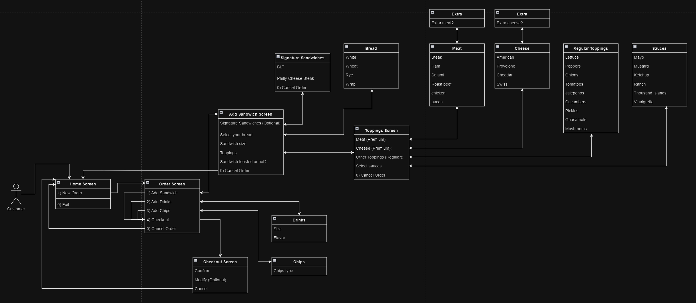
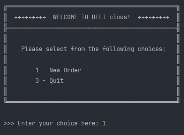
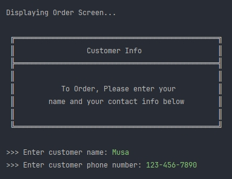
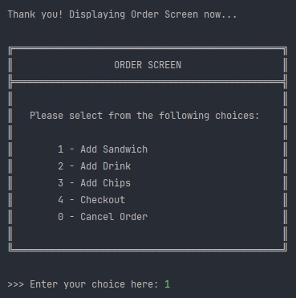
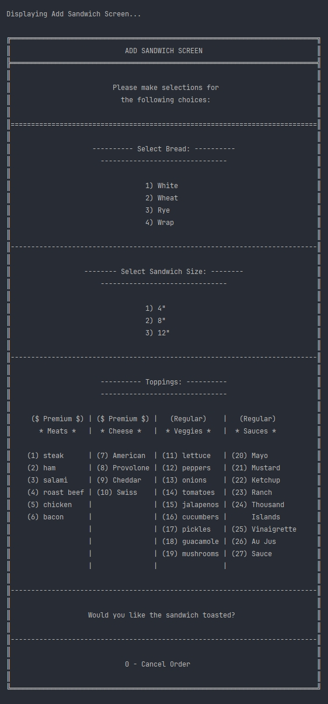
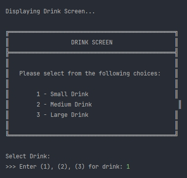
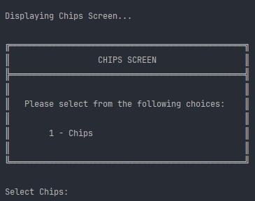
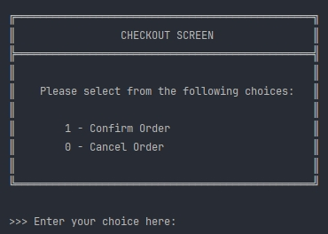
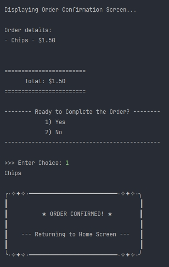

# Deli-cious Sales System

## Overview
The **Deli-cious Sales System** is a Java-based application designed for managing customer orders in a deli shop. It allows users to create customized orders consisting of sandwiches, drinks, and chips. The application uses a command-line interface to interact with customers, offering functionalities such as creating new orders, customizing sandwiches, and generating receipts.

## Features
- **Customer Management**: Create and manage customer details including name and contact information.
- **Order Processing**: Create orders with unique IDs, add items such as sandwiches, drinks, and chips, and calculate the total price.
- **Menu Management**: Define available menu items including different sizes of sandwiches, types of bread, toppings, drinks, and chips.
- **Checkout System**: Finalize and save order receipts, displaying a detailed breakdown of each item and its price.

## Classes Overview 
#### (Ordered by packages in project structure)
### 1. `Customer` (Package: `com.pluralsight.checkout`)
- Stores customer information such as name and contact details.
- Method: `createOrder(int id)` creates a new order for the customer.

### 2. `Order` (Package: `com.pluralsight.checkout`)
- Manages the items in an order, including food items and calculating the total price.
- Methods: `addItem(FoodItem item)`, `removeItem(FoodItem item)`, `removeAllItems()`, etc.

### 3. `SalesSystem` (Package: `com.pluralsight.checkout`)
- Handles multiple orders and the deli menu.
- Methods: `addOrder(Order order)`, `validateOrderID()`, `createCustomer()`, etc.

### 4. `OrderFileManager` (Package: `com.pluralsight.fileManager`)
- Handles saving receipts to a file.

### 5. `FoodItemInterface` (Package: `com.pluralsight.interfaces`)
- Interface for all food items in the system.

### 6. `FoodItem` (Abstract class, Package: `com.pluralsight.orderItems`)
- Base class for all food items, defining common attributes like name and price.

### 7. `Sandwich`, `Drink`, `Chips`, `Toppings` (Package: `com.pluralsight.orderItems`)
- Concrete classes that inherit from `FoodItem`.
- `Sandwich` includes additional customization options such as bread type, size, and toppings.

### 8. `Menu` (Package: `com.pluralsight.orderItems`)
- Defines the available items in the deli shop, including toppings, drinks, and chips.

### 9. `Main` (Package: `com.pluralsight.program`)
- Entry point of the application. Starts the `UserInterface`.

### 10. `UserInterface` (Package: `com.pluralsight.program`)
- Handles user interaction via command-line prompts, manages the flow from the home screen to checkout.

### 11. `Console` (Package: `com.pluralsight.utils`)
- Utility methods for handling console input and output with methods such as `PromptForString()`, `PromptForInt()`, and `displayDelayedString()`.

## UML Diagram
The UML class diagram provides a visual representation of the classes and their relationships.


## Userflow Diagram
The userflow diagram provides a visual representation of the flow of application through the user.



### Screenshots

<details>
<summary>Click the arrow to expand and view screenshots of the application!</summary>

**Welcome Screen**



**Customer Info Screen**



**Order Screen**



**Add Sandwich Screen**



**Drinks Screen**



**Chips Screen**



**Checkout Screen**



**Order Confirmed Message**



</details>

## Interesting Piece of Code
This piece of code is in a variable (through the use of Runnable) that creates a loop that gets the drink list, and displays the iteration number and the drink name. Then I can call that loop anywhere by doing drinkLoop.run(); which would call the loop in that variable

```java
Runnable drinkLoop = () -> {
            for (int i = 0; i < salesSystem.getMenu().getDrinkList().size(); i++) {
                Drink drink = salesSystem.getMenu().getDrinkList().get(i);
                System.out.println("║        " + (i + 1) + " - " + drink.getName() + "                         ║");
            }
        };

drinkLoop.run();
```

## Getting Started
### Prerequisites
- **Java JDK 17** or above.
- **Apache Commons Lang** library.
- A Java IDE (e.g., IntelliJ IDEA, Eclipse) or a text editor.

### Installation
1. Clone the repository:
   ```bash
   git clone <repository-url>
   ```
2. Import the project into your favorite IDE.
3. Make sure the Apache Commons Lang library is included in the project dependencies.

### Running the Application
- Run the `Main` class (`com.pluralsight.program.Main`).
- Follow the on-screen prompts to place orders, add items, and finalize the checkout.

## Usage
- When you start the application, you will be presented with the **Home Screen**.
- You can choose to create a new order or exit the program.
- Follow the prompts to add sandwiches, drinks, and chips.
- Customize sandwiches with bread type, size, and toppings.
- Finalize the order and receive a receipt in a `.txt` file.

## Project Structure
- **com.pluralsight.checkout**: Handles customer and order management.
- **com.pluralsight.fileManager**: Manages saving order receipts.
- **com.pluralsight.interfaces**: Contains interfaces used by the application.
- **com.pluralsight.orderItems**: Contains different food items such as sandwiches, drinks, chips, and toppings.
- **com.pluralsight.program**: Main application logic including the user interface.
- **com.pluralsight.utils**: Utility functions for console interactions.

## Future Enhancements
- **Graphical User Interface (GUI)**: Upgrade from a command-line interface to a GUI for better user experience.
- **Order Modification**: Allow users to modify existing orders before checkout.
- **Payment Integration**: Add a payment processing system.

## License
This project is licensed under the MIT License - see the LICENSE file for details.

## Acknowledgments
- Special thanks to YearUp for the capstone project opportunity.
- Apache Commons Lang for providing utility functions.

